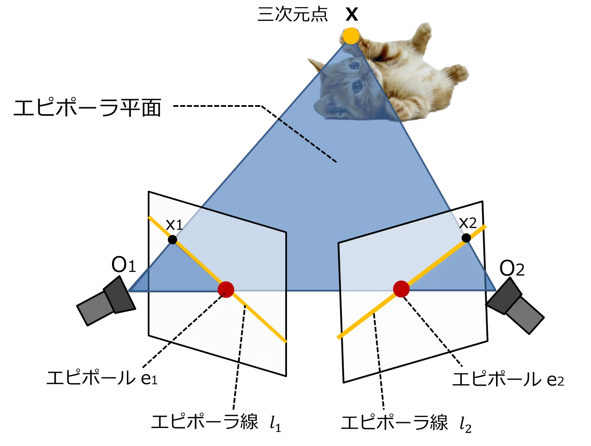
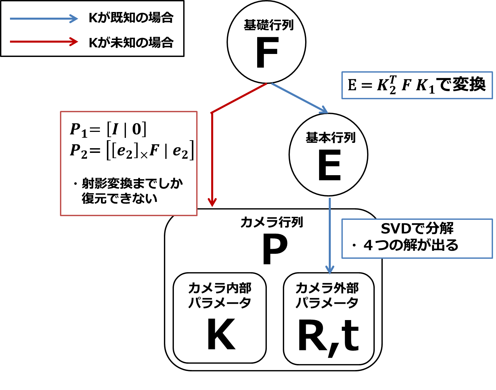

多視点から物体を撮影することで2次元画像から3次元情報を復元することができる

# エピポーラ幾何学：
２つのカメラで同じ３次元物体を異なる視点から撮影したときに生じる幾何

## < 大事な要素 >
### エピポーラ平面（図の青い平面）
二つのカメラの光学中心を O1 O2 
としたとき、三次元点 X O1 O2   
の計３点を通る平面をエピポーラ平面と呼びます。図の青い平面です。  

### エピポーラ線（図の黄色い線）
エピポーラ線とは、エピポーラ平面とそれぞれの画像平面とが交わる線のことです。  
例えば三次元点Xが画像１上に点x1として映ったとき、同じ点Xが画像２上でエピポーラ線上のどこかに映ることを示しています。  

### エピポール（図の赤い点）
各画像すべてのエピポーラ線は、必ず１点で交わります。  
それがエピポールです。  
したがって、すべてのエピポーラ線がエピポールを通ります。  
この点は、他方の画像のカメラ中心を自分の画像に投影した点です。

  

### 基礎行列(Fundamental Matrix)
3x3の行列で、カメラ内部・外部行列の情報を含んでいます。また、ある画像上の点(0次元)を、別の画像上のエピポーラ線(1次元)にマッピングする役割をもちます。
この行列を推定できると、その後カメラ運動などを推定する際に利用できるので、この行列を正しく求めることがとても大事になります。次で詳しく見ていきます。

### 基本行列(Essential Matrix)
基礎行列と名前が似ていますが、基礎行列の親戚です。3x3の行列で、カメラ外部行列の情報を含みます。カメラ内部行列Kを使って、Fから E =K1F K2 と変換できます。

カメラがキャリブレーション済みである場合 → カメラの内部パラメータが既知

変換行列を用いて2次元座標から3次元空間に変更する